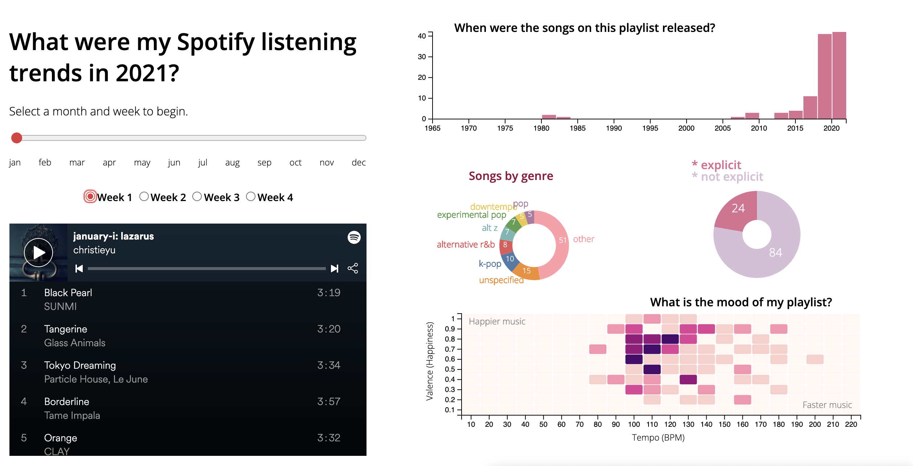

# spotify-visualizer
Final assignment for CPSC 446 (Data Visualization) at Yale. This application visualizes data from my past year of Spotify playlists using D3, a JavaScript package.

You can see a quick view of my project hosted [here](https://christieyu.com/spotify-visualizer/spotify).

The main project code is in `/spotify.html`. In `/spotify_scraper.py`, you can find my source code for scraping data off multiple [Spotify API endpoints](https://developer.spotify.com/documentation/web-api/reference/#/), with the help of [SpotiPy](https://spotipy.readthedocs.io/en/2.19.0/), a Python wrapper. In `/spotify_data.csv`, you can find the data I managed to collect.
